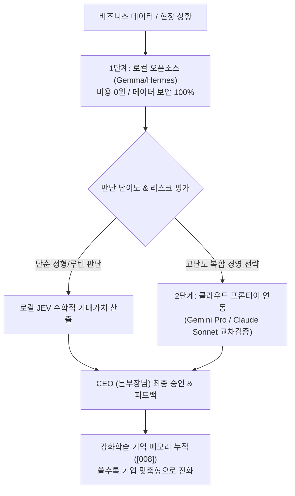

# 🏛️ [JEV 산출물 018] 오픈소스 한계 극복을 위한 하이브리드 JEV 의사결정 전략 보고서

> **작성일자**: 2026-10-03  
> **총괄책임**: ADVISOR 총괄팀장  
> **수신**: 본부장님 (Chief Executive Officer)  
> **핵심 의제**: 오픈소스 LLM의 정확도 한계와 기업형 하이브리드 듀얼 브레인(Hybrid Dual-Brain) 돌파 전략  
> **결과물 위치**: `result/[018]_오픈소스_한계극복_하이브리드_JEV_전략보고서.md`

---

## 1. 본부장님의 핵심 통찰 (Executive Insight)
> **"결국 이 유튜브의 핵심은 오픈소스를 이용한 의사결정 지원시스템을 구축하는 것이군. 그런데, 아직도 오픈소스로 100% 정확한 답변을 기대하기에는 수준차이가 있게 마련임."**

- **통찰 분석**: 수천억 파라미터의 상용 클라우드 모델(Claude 3.5 Sonnet, GPT-4o) 대비 2B~8B 수준의 로컬 오픈소스 모델은 한국어 어휘력, 복합 논리 추론, 최신 지식에서 구조적 체급 한계가 존재함.
- **경영학적 결론**: 오픈소스를 '모든 것을 다 아는 만능 두뇌'로 맹신하는 순간 기업의 AI 전환(AX)은 100% 실패함.

---

## 2. JEV 시스템이 오픈소스 한계를 돌파하는 3대 아키텍처

### ① LLM을 '결정권자'가 아닌 '계산기 부품'으로 격하 (JEV 수식 제어)
- LLM에게 최종 결정을 맡기지 않고, **[기대영향(E) × 확률(P) - 리스크 비용(C)]**의 엄격한 확률통계 수학 공식 안에 가둠.
- 오픈소스 LLM은 단지 '후보군 생성'과 '텍스트 요약'만 담당하므로 환각(Hallucination)이 시스템 전체를 붕괴시키지 못함.

### ② 하이브리드 듀얼 브레인 (Hybrid Dual-Brain) 체계
- **로컬 오픈소스 (Gemma 2B / Hermes 8B)**: 사내 기밀 유출 방지(보안 100%), 일 10만 건 반복 질의, 비용 0원(Token-Zero)의 성실한 '인턴 사원'.
- **클라우드 프론티어 (Gemini / Claude)**: 고난도 대형 전략 수립, 법적·재무적 최종 리스크 검토 시 호출하는 외부 '전문 고문단'.

### ③ 인간 피드백 강화학습 (RLHF / DPO 기억 메모리)
- 부족한 2%의 정밀도는 **본부장님의 피드백(좋아요/싫어요/수정 지시)**을 기억 메모리(`[008]`)에 지속적으로 누적 학습시켜 보완.
- 시간이 흐를수록 상용 LLM보다 '우리 회사 비즈니스 맥락을 가장 잘 아는 전속 두뇌'로 역전 진화함.

---

## 3. 10/22 KENTECH 최고경영자 특강 직강 포인트 (강의 킬러 콘텐츠)
- **강의 화두**: "왜 많은 기업들이 챗GPT를 도입하고도 3개월 만에 포기하는가?"
- **해법 제시**:
  1. "상용 AI의 화려한 말솜씨에 속지 마십시오. 기업에 필요한 것은 잡담 AI가 아니라 **'수학적 기대가치 기반의 의사결정 파이프라인(JEV)'**입니다."
  2. "데이터 유출 없는 100% 무료 로컬 오픈소스를 뼈대로 세우고, CEO의 결단 경험을 기억 메모리로 학습시키는 자립형 1인 AI 기업 구축 전략을 공개합니다."
