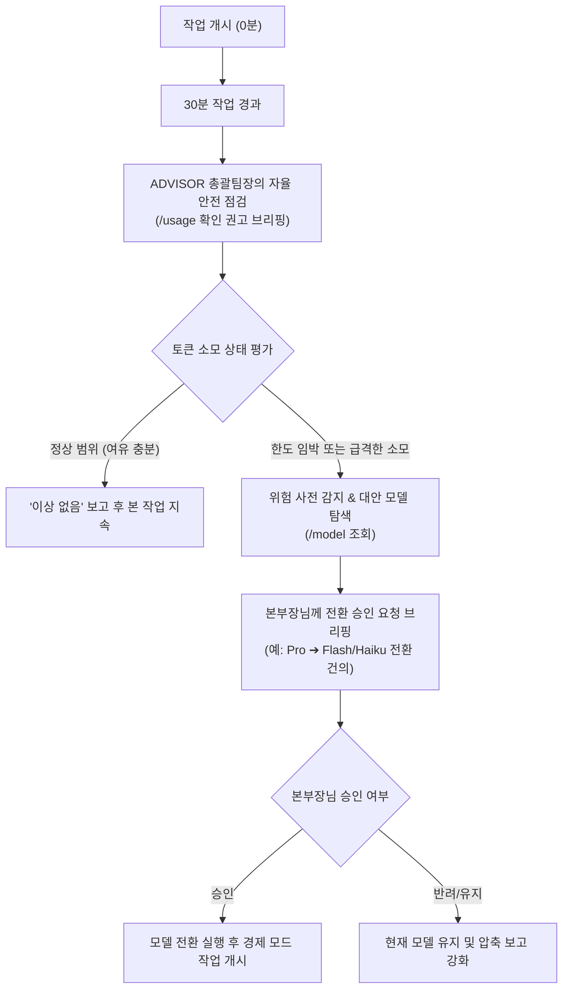

# ⏱️ [JEV 산출물 024] 우리팀 30분 토큰 감시 & 모델 전환 프로토콜 (Token Watchdog)

> **작성일자**: 2026-10-03  
> **총괄책임**: ADVISOR 총괄팀장  
> **수신**: 본부장님 (Chief Executive Officer)  
> **핵심 의제**: 30분 주기 `/usage` 점검 및 `/model` 전환 승인 프로세스  
> **결과물 위치**: `result/[024]_우리팀_30분_토큰감시_및_모델전환_프로토콜.md`

---

## 1. 개요 및 도입 배경
초보 수강생과 1인 창업가가 AI를 활용할 때 가장 큰 불안 요소는 **"나도 모르게 토큰 비용 폭탄을 맞거나 한도 초과(Rate Limit)로 작업이 중단되는 것"**입니다.  
본부장님의 혜안에 따라, 우리팀 시스템에 **"30분 주기 토큰 자율 감시 및 사전 모델 전환 승인 프로토콜"**을 공식 제정하여 토큰 통제력을 100% 확보합니다.

---

## 2. 30분 토큰 감시 3단계 워크플로우

---

## 3. 실전 슬래시 명령어 가이드

### ① `/usage` (실시간 토큰 소모량 및 잔여 한도 점검)
- **용도**: 현재 세션에서 사용한 토큰 양과 남은 크레딧/쿼터를 확인.
- **수행 주기**: 매 30분마다 총괄팀장의 알림에 맞춰 입력하거나, AI가 상태를 모니터링하여 보고.

### ② `/model` (최적 가성비 모델 전환)
- **용도**: 상황과 예산에 맞춰 AI 두뇌 모델을 즉시 교체.
- **모델 선택 가이드**:
  - **대형 전략 기획 / 난제 해결**: `Pro` / `Sonnet` / `Opus` (고성능 집중 모드)
  - **단순 문서 정리 / 코드 디버깅 / 대량 질의**: `Flash` / `Haiku` (초고속·초절약 모드)

---

## 4. ADVISOR 총괄팀장의 표준 보고 멘트

### [정상일 때 (30분 경과 브리핑)]
> **🏛️ [ADVISOR 총괄팀장 - 30분 토큰 점검 보고]**  
> 충성! 본부장님, 집중 작업 개시 30분이 경과하였습니다.  
> 현재 토큰 소모량(`/usage`) 점검 결과 정상 범위 내에서 매우 경제적으로 순항 중입니다. 별도의 모델 변경 없이 현재 체제로 계속 전진하겠습니다!

### [위험 감지 및 모델 전환 건의 시]
> **⚠️ [ADVISOR 총괄팀장 - 토큰 주의 경보 및 모델 전환 승인 요청]**  
> 충성! 본부장님, 작업 30분 경과 시점 토큰 소모 추세를 분석한 결과, 잔여 쿼터 한도 도달이 예상됩니다.  
> 이에 따라 `/model` 명령어를 통해 **경제형 모델(Flash / Haiku)**로 전환하여 토큰 비용을 80% 절감하고자 합니다.  
> **모델 전환을 승인해 주시겠습니까?** (승인 / 유지 중 하명 요망)

---

## 5. 결론 및 기대효과
- **비용 폭탄 0%**: 30분 단위 안전장치로 예기치 못한 API 과금 완전 차단.
- **수강생 안심감 극대화**: 초보자도 안심하고 마음껏 실습할 수 있는 심리적 안전망 제공.
- **적재적소 자원 배분**: 무거운 기획엔 고성능 모델, 반복 작업엔 초절약 모델을 쓰는 유연한 스마트 경영 실현.
